# LinkPlease

> Instagram comment-to-DM automation built for reliability.

LinkPlease turns keyword-triggered Instagram comments into reliable DM jobs. A rule matches a comment, the webhook is verified, the event is stored durably, and the app sends the outbound message through a mock upstream API with retries, deduplication, and final reconciliation built in.

The product is simple in concept but careful in execution: the hard part is not sending the message, it is making sure it is not lost, duplicated, or miscounted under messy real-world conditions.

---

## Why this project exists

This project solves a very specific operational problem: turning a social-media event stream into a dependable outbound messaging workflow.

The tricky parts are not glamorous. They are the ones that quietly break systems in production:

- duplicated webhook deliveries
- replayed or out-of-order event streams
- repeated comments for the same user and rule
- transient upstream failures
- provider rate limiting
- accepted messages that have not yet been confirmed delivered
- process restarts while work is queued or in flight

Instead of assuming every event is clean and every request succeeds, the app treats durable state as the core design constraint. The database is the source of truth, and the system is built to recover from disruption without silently dropping work.

---

## What the app does

At a high level, the flow is:

1. Receive a signed webhook event
2. Validate the payload and verify the signature
3. Persist the event with deduplication
4. Match the comment body against active rules
5. Create a durable DM job for the matched rule and recipient
6. Send the message through PseudoGram with rate limiting and retry handling
7. Reconcile the final message status after acceptance
8. Expose live health and stats over the API and dashboard

---

## System flow

```mermaid
flowchart LR
    A[Comment event] --> B[Webhook verification]
    B --> C[Persist + deduplicate]
    C --> D[Rule match]
    D --> E[Create DM job]
    E --> F[Rate-limited worker]
    F --> G[PseudoGram API]
    G --> H[Accepted / retry / fail]
    H --> I[Reconciliation]
    I --> J[Stats + health]
```



This is intentionally a reliability-first workflow, not a fire-and-forget automation loop.

---

## Reliability model

The project is designed around durable state and idempotency.

### Duplicate event protection

Each webhook is keyed by a unique `event_id`. Repeated deliveries are acknowledged as duplicates instead of being processed again.

### Duplicate DM protection

A DM job cannot be created twice for the same rule and recipient combination. The database enforces this uniqueness at the model level, and duplicate attempts are recorded so they are visible rather than silently lost.

### Idempotency

Outbound requests use a stable idempotency key:

```text
linkplease-dm-job-{job_id}
```

This allows retries to keep the same logical identity even when the provider or the worker retries the request.

### Retry and backoff

The worker keeps retry state in the database and backs off exponentially on transient failures. Permanent client errors are marked as failed, while transient failures and rate-limit responses are requeued.

### Rate limiting

Outbound sends are capped to a rolling window of 10 attempts in 60 seconds. Those attempts are durably recorded so the limit is respected even if the process restarts.

### Delivery reconciliation

A `202 Accepted` response means the DM was accepted, not necessarily delivered. The app creates a `Delivery` record and then polls the upstream status until it reaches a final state.

### Persistence

The durable data model includes:

- `Rule`
- `Event`
- `DMJob`
- `DMSendAttempt`
- `Delivery`
- `DMJobDuplicateBlock`

This design allows the system to recover from restarts without losing work in progress or misreporting its operational state.

### Known edge cases

The project explicitly handles the hard realities of the domain:

- out-of-order event delivery
- replayed webhooks
- `comment.deleted` payloads treated as no-op events
- delayed status reconciliation

The repo also documents real limitations in `FAILURES.md` rather than pretending the system is perfect.

---

## Architecture

The project is intentionally compact and easy to reason about.

```text
React + Vite frontend
        │
        v
FastAPI backend
        │
        +---- PostgreSQL database
        │
        +---- PseudoGram API
        │
        +---- DM worker
        │
        +---- Reconciliation worker
```

The current architecture runs the worker loops inside the FastAPI process rather than deploying them as separate production services. That choice keeps the app simple to run in a lightweight deployment while still moving the actual processing logic into durable, database-backed workers.

Docker is used for reproducible backend development and a Postgres-backed local setup without forcing the host machine to install Python tooling directly.

---

## API

The backend exposes the endpoints that matter for the product and for operator visibility.

| Method | Endpoint           | Purpose                          | Behavior                                                            |
| ------ | ------------------ | -------------------------------- | ------------------------------------------------------------------- |
| POST   | `/webhook`         | Receive a signed comment webhook | Verifies signature, stores the event once, and acknowledges quickly |
| POST   | `/rules`           | Create a rule                    | Persists a rule with keyword and DM message                         |
| GET    | `/rules`           | List rules                       | Returns active rules                                                |
| GET    | `/rules/{rule_id}` | Fetch a single rule              | Returns a rule or `404`                                             |
| GET    | `/stats`           | Read system counters             | Returns `sent`, `failed`, `queued`, and `duplicates_blocked`        |
| GET    | `/health`          | Health check                     | Returns basic service health                                        |

### Webhook behavior

The webhook endpoint does the safety checks before any business logic runs:

- reads the raw body
- verifies `X-PseudoGram-Signature` using HMAC-SHA256
- rejects malformed input or invalid signature
- persists only new events
- returns a fast `200` acknowledgement
- schedules the async processing work after the response is sent

### Stats response

```json
{
  "sent": 0,
  "failed": 0,
  "queued": 0,
  "duplicates_blocked": 0
}
```

This is the operational view used by the dashboard and by the assignment checks.

---

## Frontend

The frontend is a lightweight React + Vite dashboard for the backend system. It focuses on the practical surfaces operators need:

- live stats from `/stats`
- rule creation and listing via `/rules`
- health monitoring via `/health`
- a dark, responsive dashboard experience
- backend integration through `VITE_API_BASE_URL`

It is intentionally straightforward: a working operational UI rather than a broader product shell.

---

## Data model

The database is the reason this system is trustworthy. The main entities are:

- `rules`: keyword-based automation definitions
- `events`: incoming webhook payloads and deduplication metadata
- `dm_jobs`: the actual outbound DM work to be executed
- `dm_send_attempts`: durable rate-limit tracking
- `deliveries`: accepted sends and eventual upstream status
- `dm_job_duplicate_blocks`: records of prevented duplicate DM jobs

The important pattern here is simple: the app stores enough state to recover from restarts, replay safely, and reason about the real state of outbound work.

---

## Local development

### Docker-first setup

From the repository root:

```bash
docker compose up --build
```

This brings up the backend API and its PostgreSQL dependency. Once running:

- API: `http://localhost:8000`
- Health: `http://localhost:8000/health`

Run the backend tests in the container:

```bash
docker compose exec backend pytest -q
```

Apply the latest migration set:

```bash
docker compose exec backend alembic upgrade head
```

### Local Python setup

```bash
cd backend
python -m venv .venv
# Windows
.venv\Scripts\activate
# macOS / Linux
# source .venv/bin/activate
pip install -r requirements.txt
set DATABASE_URL=sqlite:///./linkplease.db
uvicorn app.main:app --reload --host 0.0.0.0 --port 8000
```

Start the frontend separately:

```bash
cd frontend
npm install --no-audit --no-fund
npm run dev
```

---

## Environment variables

The app expects a small set of runtime configuration values:

- `DATABASE_URL`: database URL for local or deployed environments
- `PSEUDOGRAM_BASE_URL`: upstream mock API base URL
- `PSEUDOGRAM_API_KEY`: shared secret for webhook verification and outbound requests
- `DM_WORKER_MAX_ATTEMPTS`: retry ceiling for a job
- `DM_WORKER_RETRY_BASE_SECONDS`: base backoff value
- `DM_WORKER_SENDING_LEASE_SECONDS`: stale-send lease duration
- `FRONTEND_URL`: optional CORS origin
- `DISABLE_BACKGROUND_WORKERS`: disables in-process worker threads when set

Secrets should live in the environment or deployment secret store, not in the repository.

---

## Testing and verification

The project includes a backend test suite and a frontend production build check.

### Backend

```bash
cd backend
pytest -q
```

Verified in this project context:

- 62 backend tests passed
- Docker backend build succeeds
- Docker Compose backend + PostgreSQL starts successfully
- Alembic migrations succeed in Docker
- `/health` succeeds in Docker
- single-DM and 10-DM end-to-end checks succeeded locally
- frontend production build succeeds

### Frontend

```bash
cd frontend
npm run build
```

---

## Deployment

The repository includes a Render configuration in `render.yaml`. The current implementation is designed for a simple web service with a managed Postgres database, and the worker loops are started inside the FastAPI process by default.

That is a deliberate choice for this codebase: it keeps deployment simple while preserving the important stateful behavior of the job queue and reconciliation loop.

---

## Project structure

```text
LinkPLEASE/
├── backend/
│   ├── alembic/
│   ├── app/
│   │   ├── api/
│   │   ├── models/
│   │   ├── schemas/
│   │   ├── security/
│   │   └── services/
│   ├── tests/
│   ├── Dockerfile
│   ├── .env.example
│   ├── requirements.txt
│   └── pytest.ini
├── frontend/
│   ├── src/
│   ├── package.json
│   ├── vite.config.mjs
│   └── index.html
├── docker-compose.yml
├── render.yaml
├── FAILURES.md
├── README.md
└── .gitignore
```

---

## Known limitations

This project is intentionally honest about its constraints. The main failure modes are documented in `FAILURES.md`.

The important caveats are:

- crash windows between send acceptance and delivery tracking
- transient upstream failures after acceptance
- reconciliation lag during worker downtime
- race conditions around duplicate blocking under concurrency

The app is designed to be reliable within realistic boundaries, not to claim impossible guarantees.

---

## Final note

LinkPlease is a practical engineering project built around a simple principle: when outbound automation depends on external systems and repeated inbound events, durable state matters more than cleverness.

It is built to be understandable, dependable, and easy to run locally while still reflecting the realities of an imperfect upstream API and an asynchronous event stream.
